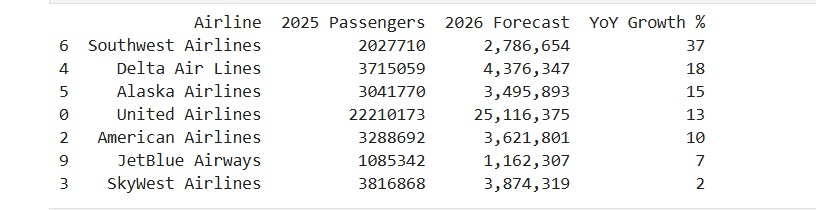
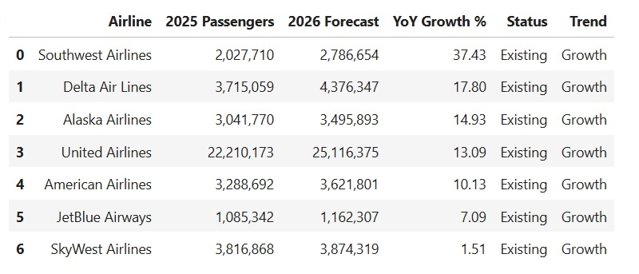
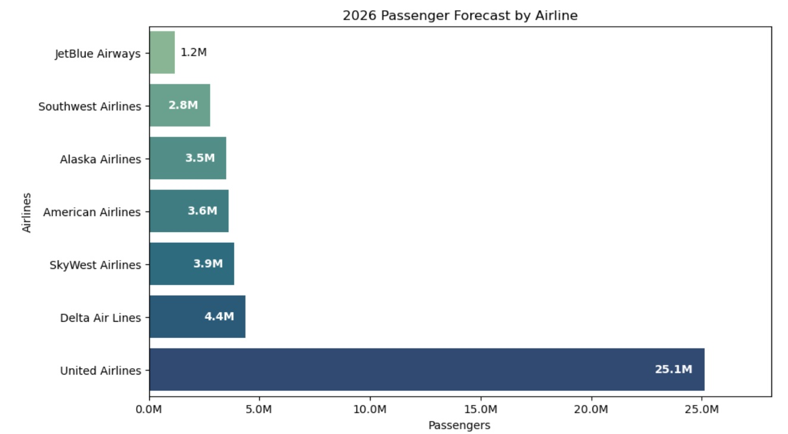
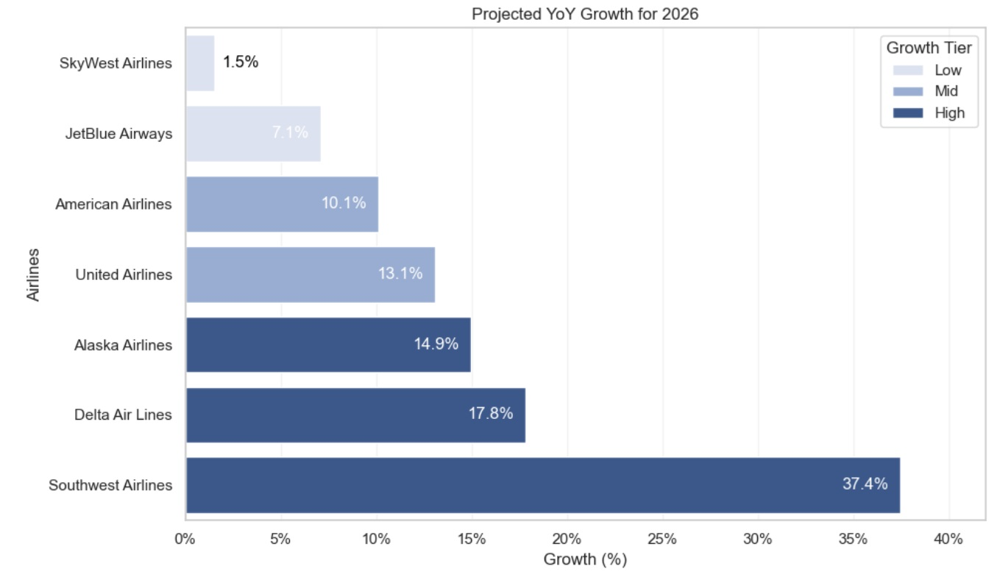
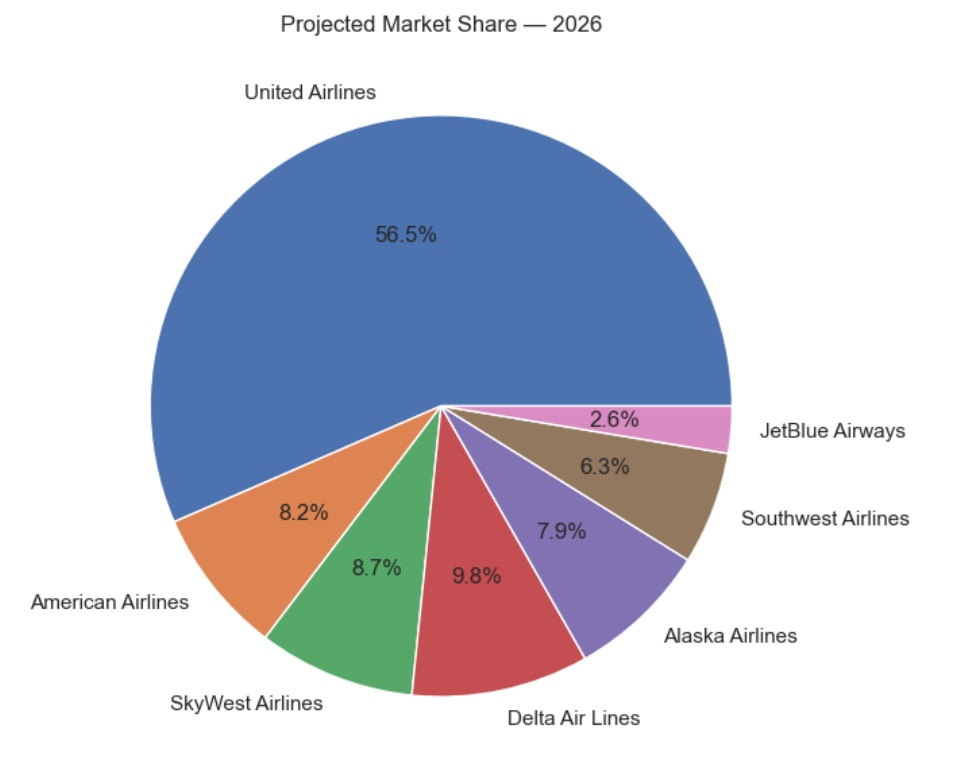

# Airline Passenger Forecast for 2026

## Project Overview
This project analyses historical air traffic passenger data of San Francisco International Airport to forecast airline performance for 2026 using machine learning techniques.

Using monthly passenger statistics, the analysis estimates future demand, ranks airlines by growth, and evaluates projected market share among major carriers.
________________________________________
## Dataset
File: Air_Traffic_Passenger_Statistics.csv

Source: https://catalog.data.gov/dataset/air-traffic-passenger-statistics

The dataset contains monthly passenger counts by airline and route type.
________________________________________

## Objectives
- [x] Build a clean time-series dataset at the airline level
- [x] Forecast passenger volume for 2026
- [x] Calculate projected year-over-year growth
- [x] Identify growth leaders and market structure
- [x] Visualize forecast results
________________________________________

## Data Preparation
- Merged operating and published airline names into a unified field
- Converted dates to proper datetime format
- Aggregated passenger counts by month and airline
- Filtered the analysis period (2000–2025)
- Selected the top airlines by total traffic

``` Python

import pandas as pd
import numpy as np

# Load the raw air traffic passenger dataset from CSV
df = pd.read_csv(
    r'C:\Users\bobma\PycharmProjects\ML\Air_Traffic_Passenger_Statistics.csv'
)

# ✅ Convert date column BEFORE any grouping
df['Activity Period Start Date'] = pd.to_datetime(
    df['Activity Period Start Date'],
    errors='coerce'
)

# Create a unified airline column:
# use the operating airline when available,
# otherwise fall back to the published airline
df['Airline'] = df['Operating Airline'].fillna(df['Published Airline'])

# (optional but recommended) drop rows with missing airline or date
df = df.dropna(subset=['Airline', 'Activity Period Start Date'])

# Aggregate passenger counts by month and airline
# This produces total passengers transported by each airline per month
airline_monthly = (
    df.groupby(['Activity Period Start Date','Airline'])['Passenger Count']
      .sum()
      .reset_index()
      .sort_values('Activity Period Start Date')
)
```
________________________________________

## 🤖 Forecasting Approach
A machine learning model was used for time-series forecasting.
Model: Random Forest Regressor
Feature engineering included:
- Lag features (1 month, 12 months)
- Rolling averages (3-month, 12-month)
- Seasonal indicators (month, year)
Forecasts were generated for all months of 2026 and aggregated annually.

``` Python
# Create forecast function for one airline

from sklearn.ensemble import RandomForestRegressor

def forecast_airline(data):

    ts = data.set_index('Activity Period Start Date') \
             .sort_index() \
             .asfreq('MS')

    ts = ts.rename(columns={'Passenger Count': 'Passengers'})

    # --- features ---
    ts['lag_1']  = ts['Passengers'].shift(1)
    ts['lag_12'] = ts['Passengers'].shift(12)
    ts['roll_3']  = ts['Passengers'].rolling(3).mean()
    ts['roll_12'] = ts['Passengers'].rolling(12).mean()
    ts['month'] = ts.index.month
    ts['year']  = ts.index.year

    ts = ts.dropna()

    train = ts.iloc[:-12]

    X = train.drop('Passengers', axis=1)
    y = train['Passengers']

    model = RandomForestRegressor(n_estimators=200, random_state=42)
    model.fit(X, y)

    # --- Forecast 2026 ---
    future_dates = pd.date_range('2026-01-01', periods=12, freq='MS')
    last_data = ts.copy()

    preds = []

    for date in future_dates:

        last_row = last_data.iloc[-1]

        new_row = {
            'lag_1':  last_row['Passengers'],
            'lag_12': last_data.iloc[-12]['Passengers'],
            'roll_3':  last_data['Passengers'].iloc[-3:].mean(),
            'roll_12': last_data['Passengers'].iloc[-12:].mean(),
            'month': date.month,
            'year':  date.year
        }

        X_new = pd.DataFrame([new_row])
        pred = model.predict(X_new)[0]

        preds.append(pred)

        last_data.loc[date] = [pred] + list(new_row.values())

    return sum(preds)
```
________________________________________

## Key Results
- [x]	Fastest projected growth: Southwest Airlines (~37% YoY)
- [x]	Largest projected airline: United Airlines (~25.1M passengers)
- [x]	No major airlines projected to decline in 2026
________________________________________

## Visualizations
The project includes:
- [x]	2026 passenger forecast by airline
- [x]	YoY growth ranking with performance tiers
- [x]	Projected market share distribution

``` Python
# Airline Forecast 2026

import matplotlib.pyplot as plt
import seaborn as sns
import matplotlib.ticker as ticker

plt.figure(figsize=(10,6))

# Sort airlines by forecasted passengers (ascending for horizontal bars)
plot_df = results_df_active.sort_values('2026 Forecast')

sns.barplot(
    data=plot_df,
    y='Airline',
    x='2026 Forecast',
    hue='Airline',
    palette='crest',
    legend=False
)

plt.title('2026 Passenger Forecast by Airline')

ax = plt.gca()

# Format x-axis in millions (e.g., 12.5M)
ax.xaxis.set_major_formatter(
    ticker.FuncFormatter(lambda x, pos: f'{x/1e6:.1f}M')
)

plt.xlabel('Passengers')
plt.ylabel('Airlines')

# Extend x-axis slightly so labels are not clipped
ax.set_xlim(0, plot_df['2026 Forecast'].max() * 1.12)

# Add value labels to bars
for p in ax.patches:
    w = p.get_width()
    h = p.get_height()

    if h < 0.3 or w <= 0:
        continue

    y = p.get_y() + h/2
    label = f'{w/1e6:.1f}M'

    # For very small bars — place label outside
    if w < plot_df['2026 Forecast'].max() * 0.08:
        ax.text(
            w + plot_df['2026 Forecast'].max() * 0.01,
            y,
            label,
            va='center',
            ha='left',
            color='black'
        )

    # For larger bars — place label inside (right-aligned)
    else:
        ax.text(
            w - plot_df['2026 Forecast'].max() * 0.02,
            y,
            label,
            va='center',
            ha='right',
            color='white',
            fontsize=10,
            fontweight='bold'
        )

plt.show()
```
________________________________________

## Tech Stack
- [x]	Python
- [x]	Pandas & NumPy
- [x]	Scikit-learn
- [x]	Matplotlib & Seaborn
________________________________________

## Use Cases
Demand forecasting is critical for airline operations, including:
- [x]	Capacity planning
- [x]	Route optimization
- [x]	Pricing strategy
- [x]	Workforce planning
- [x]	Long-term strategic decisions

________________________________________

## Key dashboards

Active airlines by year-over-year growth in descending order to rank carriers from fastest-growing to slowest-growing



ACTIVE AIRLINES ONLY



2026 Passenger Forecast by Airline



Projected YoY Growth for 2026



Projected Market Share — 2026


